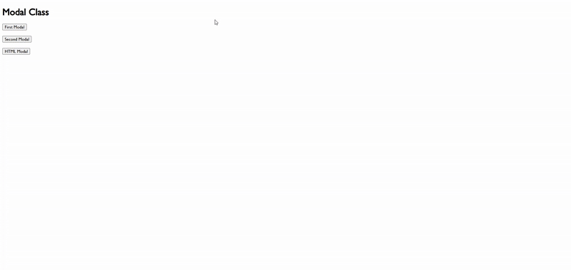

# DigitalDash

## 🚀 Mission Statement

DigitalDash transforms regular walks into amazing adventures, DigitalDash's immersive virtual walking experiences enable people to travel the world and improve their well-being digitally.

---

## ⚙️ Web App Requirements

### Server & Environment

- PHP 8.0 or higher
- Web Server (Apache or Nginx)
- Composer

### Required Libraries

- PHPMailer
- PHPDotEnv

---

## ⚖️ Development Guidelines

1. **Webpage Placement**
- All web pages must be created in the `public/` directory.
2. **Assets & Resources**
- Images should be stored and accessed in the `assets/` directory.
3. **Navigation & Footer**
- Found in the `components/` directory.
- You can modify them, but ensure href URLs remain correct.
4. **Stylesheets**
- All CSS files belong in the `css/ directory`.
- You may create your own or use the existing `styles.css`.
5. **JavaScript Usage**
- All JavaScript files go into the `js/` directory.
- Internal JavaScript is allowed for webpage-specific elements.
- Recommended:
    - Define reusable functions in `scripts.js`.
    - Use `classes.js` only if creating JavaScript classes.
- If modifying nav or footer, ensure fallback behavior in `components.js`.
6. **PHP Management**
- All PHP files will be created and maintained by Wai

```shell
📁 Project_Name/
    ├── 🚫 db
    ├── 📂 github
    ├── 🚫 php
    ├── 📂 public
        ├── 📂 assets
        ├── 📂 components
        ├── 📂 css
        ├── 📂 js
        ├── 🚫 php
        ├── ➡️ !! INSERT YOUR WEBPAGE HERE !!
        ├── 📄 index.html 
    ├── 📄 .gitignore
    ├── 📄 README.md
```

---

## 📝 HTML Boilerplate

This HTML boilerplate establishes the essential structure for a webpage. The head section sets up encoding, viewport settings, and styling through an external CSS file. Within the body, a navigation bar and footer are included, along with a placeholder for content. JavaScript files handle UI components and additional functionality, creating a scalable foundation for further development.

- Simply copy and paste it into your new `HTML` file.

```HTML
<!DOCTYPE html>

<html lang="en">

<head>
    <meta charset="UTF-8">
    <meta name="viewport" content="width=device-width, initial-scale=1.0">
    <title>DigitalDash</title>

    <link rel="stylesheet" href="https://cdnjs.cloudflare.com/ajax/libs/font-awesome/6.7.2/css/all.min.css">
    <link rel="stylesheet" href="css/styles.css">
</head>

<body>
    <nav id="nav"></nav>

    <main>
        <!-- Add Content Here -->
    </main>

    <footer id="footer"></footer>

    <!-- JavaScript -->
    <script src="js/components.js"></script>
    <script src="js/scripts.js" type="module"></script>
</body>

</html>
```

---

# 📦 Reusable Components

📌 **Requirement**: Before proceeding, ensure your page includes the following line of code for the *components* to function correctly:

```html
<script src="js/scripts.js" type="module"></script>
```
---

## ⬜ Modals



This guide explains how to use the `Modal` class to create dynamic modals in a web application. The `Modal` class is reusable, allowing modals to be triggered by buttons with custom content, making it a flexible solution for enhancing user interaction.

### Syntax

```JavaScript
onclick="initModal(target, string)"
```

### Parameters

> **target**: *A reference to the button that triggered the modal.*

> **string**: *A structured object that can parse HTML into the modal*

---

### Usage

- Pass the `this` keyword as `target` to reference the triggering element.

- `string` can accept either plain text or HTML content, as shown below:

#### Example with normal text

```HTML
<!-- Passing Normal Text -->
<button onclick="initModal(this, 'This is normal text!')">Modal</button>
```

#### Example with HTML Markup

```HTML
<!-- Passing HTML --> 
<button onclick="initModal(this, '<p>This is <b>HTML</b> content!</p>')">Modal</button>
```

This enhances the flexibility and interactivity of your modal container, allowing for a more dynamic user experience.

---

> ⚠️ Note: If your modal requires more complex content, follow best coding practices to ensure maintainability and readability.

---

### Using Template Literals for New Lines

To improve readability and organization, use `template literals` (backticks ``) instead of single or double quotes. Template literals preserve formatting and make HTML easier to manage.

#### Example with Template Literals

```HTML
<button onclick="initModal(this, `
    <h2>Modal Heading</h2>
    <p>I am a paragraph inside the modal!</p>
    <a href='#'>I am a link!</a>
`)">Open Modal</button>
```

This approach ensures a clean structure and enhances maintainability in your code.

---

## 📜 Accordions


This guide explains how to use the `Accordion` class to create dynamic, interactive accordions in a web application. The class is designed for reusability, allowing you to trigger accordions with buttons and include custom content.

### Syntax

```JavaScript
onclick="initAccordion(target, id, height, string)"
```

### Parameters

> **target**: *A reference to the DOM element (button) that triggered the accordion.*

> **id**: *A unique identifier for the accordion element to ensure it can be targeted and accessed individually.*

> **height**: *A boolean value indicating whether the accordion should animate its height or use static display properties.*

> **string**: *The content (HTML string or structured object) that will be parsed and displayed inside the accordion.*

### Setup

Before initializing the accordion, add the following custom data attribute to the target button element:

```HTML
data-accordion="true"
```
### Example

The full implementation would look like this:

```HTML
<button data-accordion="true" onclick="initAccordion(
    this, 
    'unique_accordion_id', 
    true, 
    'This is the content of the accordion!'
)">My Accordion</button>
```

### Usage

- When passing values to the `id` and `string` parameters, ensure they are wrapped in either single or double quotes.

- The accordion can parse and display HTML markup inside the content parameter. For multiline strings, it’s recommended to use `template literals` (backticks ``) for better readability and handling of complex content.

### Example with HTML Markup

```HTML
<button data-accordion="true" onclick="initAccordion(
    this, 
    'my_custom_id', 
    true, 
    `
        <h2>My Accordion</h2>
        <p>I am HTML markup inside the accordion!</p>
    `
)">My Accordion</button>
```
---

<p style='text-align: center'>© 2025 DigitalDash. All rights reserved.</p>
